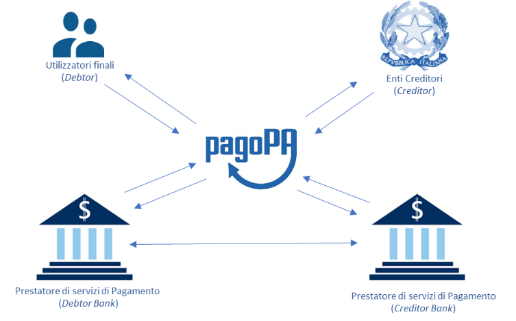

SEZIONE I – FUNZIONAMENTO GENERALE DEL SISTEMA

Funzionamento generale del sistema
==================================

Obiettivo strategico del Sistema pagoPA è quello di facilitare e
diffondere gli strumenti di pagamento elettronici, in particolare,
quelli riferiti agli incassi della Pubblica Amministrazione, che da un
lato associno, nel rispetto delle situazioni già in essere, benefici ai
fini della gestione dei servizi di tesoreria, dall’altro consentano alla
Pubblica Amministrazione di dotarsi di nuove modalità di rapporto con i
cittadini e le imprese per tutte le problematiche di incasso,
assicurando nel contempo un coordinamento a livello nazionale della
concreta attuazione ed evoluzione nel tempo del sistema.

Ciò consente alla Pubblica Amministrazione di eliminare gli onerosi
processi di gestione del back office, attraverso processi automatizzati
di riconciliazione. Identico beneficio è atteso per ogni operatore del
settore dei pagamenti che aderisca all’iniziativa che si inquadra, da un
lato, nella più ampia regolamentazione europea in materia di servizi di
pagamento introdotto con il progetto SEPA, dall’altro, nell’attuazione
delle norme introdotte dal nuovo articolo 5 del CAD in tema di pagamenti
informatici a favore della Pubblica Amministrazione.

Le suddette norme trovano una concreta attuazione tramite
l’infrastruttura abilitante, denominata Nodo dei Pagamenti-SPC
(NodoSPC). Tale infrastruttura si configura come una componente del
Sistema Pubblico di Connettività che regola - a livello nazionale - le
modalità organizzative e tecnico-infrastrutturali di funzionamento dei
pagamenti verso la Pubblica Amministrazione, senza alterare i rapporti
commerciali tra i diversi attori del processo, ma introducendo più
semplici modalità di interazione.

In questo contesto l’impianto si configura come un sistema di livello
nazionale definito anche come “Dominio dei Pagamenti della Pubblica
Amministrazione” (Dominio), che ha assunto a partire dalla fine
dell'anno 2014, con la registrazione del correlato marchio, la
denominazione di Sistema pagoPA.

Il modello di funzionamento del Sistema fa riferimento ai principi del
*Four Corners* *model* definito dall’European Payment Council ed è
riportato nel diagramma di **Figura 1**, nel quale l’infrastruttura
costituita dal NodoSPC si pone quale facilitatore del colloquio i vari
soggetti coinvolti:

+-----------------------------------+-----------------------------------+
| **Utilizzatore finale**           | Rappresenta il privato cittadino, |
|                                   | professionista, impresa, che      |
| **(Debtor)**                      | effettua pagamenti a favore della |
|                                   | Pubblica Amministrazione con      |
|                                   | modalità informatiche. L’identità |
|                                   | dell’utilizzatore finale può      |
|                                   | essere determinata con modalità   |
|                                   | informatiche (tipicamente SPID)   |
|                                   | per accedere ai servizi           |
|                                   | informatici dell’Ente Creditore.  |
|                                   |                                   |
|                                   | Nell’ambito del processo di       |
|                                   | pagamento si distingue il ruolo   |
|                                   | del **soggetto debitore**, cioè   |
|                                   | colui che ha contratto un debito  |
|                                   | a favore dell’Ente Creditore,     |
|                                   | ovvero effettua un pagamento di   |
|                                   | sua iniziativa per ottenere a un  |
|                                   | servizio o una certificazione.    |
|                                   | Nel rapporto con Ente Creditore   |
|                                   | si può presumere che              |
|                                   | l’utilizzatore finale sia il      |
|                                   | soggetto debitore                 |
|                                   |                                   |
|                                   | Si distingue infine il **soggetto |
|                                   | versante**, ovvero come colui     |
|                                   | accede ai servizi informatici dal |
|                                   | Prestatore dei Servizi di         |
|                                   | Pagamento, e dispone il pagamento |
|                                   | a favore dell’Ente Creditore.     |
+-----------------------------------+-----------------------------------+
| **Ente Creditore**                | Soggetto a cui l’utilizzatore     |
|                                   | finale richiede il servizio e che |
| **(Creditor)**                    | nei confronti del quali si        |
|                                   | configura come “creditore” per le |
|                                   | somme a vario titolo da questi    |
|                                   | dovute.                           |
|                                   |                                   |
|                                   | L’Ente Creditore, che identifica  |
|                                   | il soggetto pagatore e la causale |
|                                   | del pagamento, offre il servizio  |
|                                   | tramite il NodoSPC a cui accede   |
|                                   | direttamente o tramite un         |
|                                   | soggetto pubblico o privato,      |
|                                   | quale intermediario tecnologico   |
|                                   | nei confronti dell’Ente Creditore |
|                                   | .                                 |
+-----------------------------------+-----------------------------------+
| **Prestatore di Servizi di        | È il soggetto, abilitato dalle    |
| Pagamento**                       | norme vigenti in materia, ad      |
|                                   | eseguire le richieste di          |
| **(Debtor e Creditor Bank)**      | pagamento in via elettronica ed a |
|                                   | restituire la ricevuta            |
|                                   | elettronica di avvenuto           |
|                                   | pagamento/incasso.                |
|                                   |                                   |
|                                   | Il Prestatore di Servizi di       |
|                                   | Pagamento offre i propri servizi  |
|                                   | di pagamento mettendo a           |
|                                   | disposizione direttamente o       |
|                                   | tramite terze parti               |
|                                   | (intermediari) i canali di        |
|                                   | pagamento, fisici e telematici,   |
|                                   | su cui l’utilizzatore finale può  |
|                                   | effettuare l’operazione.          |
|                                   |                                   |
|                                   | In questo contesto il Prestatore  |
|                                   | di Servizi di Pagamento può       |
|                                   | svolgere anche, sulla base di     |
|                                   | appositi accordi con l’ente,      |
|                                   | funzioni di “Incasso” per conto   |
|                                   | dello stesso e provvedere,        |
|                                   | laddove richiesto, al successivo  |
|                                   | riversamento delle somme          |
|                                   | percepite sui conti di tesoreria  |
|                                   | che l’Ente Creditore detiene      |
|                                   | presso il Prestatore di Servizi   |
|                                   | di Pagamento dell’Ente Creditore. |
|                                   |                                   |
|                                   | È il Prestatore di Servizi di     |
|                                   | Pagamento che, nel rispetto delle |
|                                   | normative vigenti, svolge le      |
|                                   | proprie funzioni di Tesoreria o   |
|                                   | di Cassa nei confronti dell’Ente  |
|                                   | Creditore e può non coincidere    |
|                                   | con il Prestatore di Servizi di   |
|                                   | Pagamento dell’Ente Creditore     |
|                                   | stesso.                           |
|                                   |                                   |
|                                   | L’utilizzo dell’infrastruttura    |
|                                   | del NodoSPC non altera in alcun   |
|                                   | modo i rapporti esistenti tra     |
|                                   | l’Ente Creditore ed il proprio    |
|                                   | istituto tesoriere.               |
+-----------------------------------+-----------------------------------+

|image0|

**Figura** **1: EPC Four Corners model**

Il perfezionamento delle operazioni tra banche avviene attraverso il
sistema di regolamento e compensazione (CSM) utilizzando le regole SEPA.

Il sistema supporta anche altri tipi di operazioni di pagamento che
risultano dal collegamento tra più servizi di pagamento o tra servizi di
pagamento e altre operazioni ad essi contigue, così come definito dal
Provvedimento Banca d’Italia del 5 luglio 2011 in materia di diritti e
obblighi delle parti nei servizi di pagamento.

Dal punto di vista organizzativo, la partecipazione al sistema si
configura attraverso la sottoscrizione di accordi di servizio tra
l’Agenzia per l’Italia Digitale, i Prestatori di Servizi di Pagamento,
le Pubbliche Amministrazioni ed eventualmente i gestori di pubblici
servizi: ciò consente di stabilire un rapporto di collaborazione “molti
a molti”, accelerando il processo di attuazione del sistema.

La struttura del sistema prevede inoltre la possibilità che le attività
legate all’effettuazione dei pagamenti siano eseguite, in tutto od in
parte, da Intermediari tecnologici (soggetti pubblici e/o privati) per
conto sia delle Pubbliche Amministrazioni che dei Prestatori di servizi
di pagamento:

-  Un Intermediario tecnologico è un soggetto aderente al NodoSPC come
   Ente Creditore (ad esempio: Regione), che quindi ha già accettato e
   si è obbligato al rispetto delle Linee Guida e dei relativi allegati
   e che risulta, altresì, responsabile, nei confronti dell’Agenzia per
   l’Italia Digitale, delle attività tecniche per l’interfacciamento con
   il NodoSPC.

-  Viceversa, il Partner tecnologico è un mero fornitore dell’Ente
   Creditore utilizzato in via strumentale per l’esecuzione delle
   attività tecniche per l’interfacciamento con il NodoSPC, ferma
   restando la responsabilità nei confronti di AgID in capo all’Ente
   Creditore. Si precisa che l’Agenzia per l’Italia Digitale esclude
   l’adesione al NodoSPC da parte del Partner tecnologico in quanto
   tale.

Si precisa che l’utilizzo di un particolare Intermediario tecnologico o
Partner tecnologico può essere limitato ad una parte delle attività
dell’Ente Creditore, mentre le rimanenti attività possono essere
gestiste da un altro soggetto Intermediario e/o Partner oppure in
proprio dall’ente stesso: possono cioè coesistere situazioni miste,
nelle quali i servizi sono erogati da una molteplicità di soggetti,
compreso l’Ente Creditore, sempre nel rispetto delle Linee guida.

Anche i Prestatori di Servizi di Pagamento possono utilizzare degli
intermediari per connettersi al NodoSPC o per offrire i propri servizi
di pagamento; tali soggetti possono essere rappresentati da altri
prestatori di servizi di pagamento ovvero da circuiti o consorzi
costituiti in ambito finanziario.

Rimangono, comunque, inalterate le responsabilità di Ente Creditore e
Prestatori di Servizi di Pagamento nei confronti delle proprie
controparti diverse dall’Agenzia per l’Italia Digitale e, in
particolare, degli utilizzatori finali.

Il sistema è corredato da un ambiente di sperimentazione da utilizzare
dai nuovi aderenti al sistema e per effettuare collaudi su eventuali
modifiche apportate alle presenti Specifiche attuative a seguito di
variazioni conseguenti a modificazioni della normativa, alle mutate
esigenze delle pubbliche amministrazioni e degli utenti, all’evoluzione
del contesto tecnologico.

Il ciclo di vita del pagamento gestito sul Sistema pagoPA
---------------------------------------------------------

Nell’ambito delle relazioni tra l’utilizzatore finale e gli Enti
Creditori, la necessità di effettuare pagamenti a favore di questi
ultimi è sempre associata a procedimenti amministrativi che prevedono il
rispetto di regole per il loro corretto svolgimento (ad esempio: la
verifica di prerequisiti) e seguono un preordinato “Ciclo di vita” che
può essere schematizzato nella **Figura 2**.

|image1|

**Figura** **2: Ciclo di vita del pagamento**

1. L’esigenza del pagamento può nascere in due modi che innescano
   processi di business differenti:

   -  sulla base di un bisogno dell’Utilizzatore finale che necessita,
      ad esempio, di un servizio da parte dell’ente

   -  quando quest’ultimo deve richiedere all’Utilizzatore finale
      l’estinzione di un debito creatosi nei suoi confronti: ad esempio
      il pagamento di una multa o di un’ammenda.

2. L’esigenza di pagamento si concretizza attraverso la generazione di
   una **posizione debitoria**, cioè l’insieme di informazioni che
   l’Ente Creditore deve memorizzare in appositi archivi per consentire
   il pagamento e la successiva fase di riconciliazione.

3. L’utilizzatore finale sceglie il Prestatore di Servizi di Pagamento e
   effettua il pagamento. Il Prestatore di Servizi di Pagamento del
   pagatore incamera i fondi da destinare all’Ente Creditore.

4. Il Prestatore di Servizi di Pagamento del pagatore esegue il
   regolamento contabile dell’operazione accreditando il conto indicato
   dall’Ente Creditore con un SEPA Credit Transfer, salvo le eccezioni
   previste dalla vigente normativa di settore.

5. L’Ente Creditore esegue la fase di riconciliazione contabile del
   pagamento

6. L’Ente Creditore rilascia - se previsto – la relativa quietanza.

L’esecuzione di pagamenti telematici prevede l’interazione (realizzata
tramite tecnologia *Web service*) tra i sistemi informativi dei vari
attori aderenti al Dominio. Il NodoSPC è il centro stella del sistema
che assicura l’interoperabilità dei sistemi dei soggetti aderenti
rendendo disponibili primitive e metodi per l’interscambio dei flussi di
dati, nonché l’interfaccia per la selezione del Prestatore di Servizi di
Pagamento del pagatore. Tutte le funzionalità per la definizione e la
gestione dei pagamenti dovranno essere rese disponibili dai partecipanti
al Dominio, ognuno secondo il proprio ruolo.

A tal fine il NodoSPC gestisce diversi *workflow* applicativi che
prevedono lo scambio di oggetti contenenti le informazioni necessarie a
garantire la corretta gestione dei processi. Tali *workflow* sono
descritti nel dettaglio nella sezione III

L’adesione al Sistema pagoPA
----------------------------

Il sistema complessivo - formato dalla comunità di Enti Creditori,
Prestatori di Servizi di Pagamento ed eventuali gestori di pubblici
servizi aderenti e dai loro intermediari tecnologici, che possono
accedere ed utilizzare il Servizio – costituisce, come detto sopra il
“Dominio dei Pagamenti delle Pubbliche Amministrazioni”, altrimenti
denominato “Dominio dei Pagamenti dell’Ente Creditore” (o più brevemente
Dominio). Implicitamente con il termine di Dominio ci si riferisce anche
alle componenti tecnico-organizzative di tali attori.

L’utilizzo dei servizi messi a disposizione dal NodoSPC è attivato
attraverso apposite procedure rese disponibili sul sito dell’Agenzia per
l’Italia Digitale. In particolare:

-  le Pubbliche Amministrazioni e i gestori di pubblici servizi
   sottoscrivono con l’Agenzia per l’Italia Digitale specifiche lettere
   di adesione;

-  i prestatori di servizi di pagamento sottoscrivono con l’Agenzia per
   l’Italia Digitale, su base volontaria, appositi Accordi di Servizio.

Nella Sezione IV sono descritte le procedure di accreditamento degli
Enti Creditori e dei Prestatori di Servizi di Pagamento.

Ogni Ente Creditore e Prestatore di Servizi di Pagamento aderente può,
per lo svolgimento delle attività tecniche, utilizzare intermediari
rimanendo comunque responsabile in quanto mittente o destinatario logico
dei flussi.

Tutto ciò è subordinato alla preventiva comunicazione all’Agenzia per
l’Italia Digitale che dovrà provvedere alla necessaria configurazione
del NodoSPC.

Nel Dominio, le attività di pertinenza di ogni soggetto sono effettuate
conformemente ai requisiti di riservatezza e di protezione da accessi
non autorizzati. A Tal fine l’Agenzia per l’Italia Digitale rende
disponibile SPID (Sistema Pubblico di Identità Digitale). Inoltre gli
indirizzi internet dei servizi dedicati ai pagamenti devono essere
inoltre pubblicati sull'Indice delle Pubbliche Amministrazioni
(IPA [1]_) istituito con il DPCM del 31 ottobre 2000 recante le regole
tecniche per il protocollo informatico.

Si ricorda, altresì, che i siti Web di cui all'art. 3, comma 1, della
Legge 9 gennaio 2004, n. 4 devono rispettare i requisiti di
accessibilità previsti dall'Allegato A del DM 8 luglio 2005 [2]_,
rispettando, tra l'altro, il punto 3 dei criteri di conformità (Processi
completi: quando un servizio è erogato mediante un processo che si
sviluppa su più pagine web allora tutte le pagine web ad esso relative
devono essere conformi, anche quando tali pagine si trovino su siti
diversi). Per ulteriori riferimenti, consultare la sezione accessibilità
del sito dell’Agenzia per l'Italia Digitale.

Gli utilizzatori finali non sono membri del Dominio: pertanto il loro
riconoscimento e l’abilitazione ad effettuare attività che
determineranno l’invocazione dei Servizi di Nodo è a cura dei soggetti
aderenti (Ente Creditore, Prestatori di Servizi di Pagamento e/o
intermediari da questi utilizzati) che erogano i servizi applicativi.

*Governance* del sistema
------------------------

Stante la valenza infrastrutturale dell’iniziativa, la guida ed il
controllo del sistema (*governance*) è affidata all’\ **Agenzia per
l’Italia Digitale**, che assicura la gestione del sistema attraverso la
definizione di regole e standard, definisce l’elenco delle Pubbliche
Amministrazioni e dei Prestatori di Servizi di Pagamento partecipanti al
sistema, provvede alla gestione ed al monitoraggio dell’infrastruttura;

Gli oggetti scambiati
---------------------

Nei *workflow* applicativi gestiti dal NodoSPC è previsto lo scambio di
oggetti applicativi costituiti da documenti informatici. Le funzioni
primarie sono assicurate dallo scambio dei seguenti oggetti e
informazioni:

-  *Richiesta Pagamento Telematico* (RPT). Emessa dall’Ente Creditore
   definisce tutti gli elementi caratterizzanti il pagamento nonché i
   parametri necessari all’esecuzione;

-  *Ricevuta Telematica* (RT). Emessa da un Prestatore di Servizi di
   Pagamento a valle di un pagamento innescato da una richiesta di
   pagamento telematico, definisce gli elementi necessari a qualificare
   l’esito dell’operazione;

-  *Richiesta Revoca* (RR). Emessa da un Ente aderente per richiedere
   alla controparte la revoca di una ricevuta telematica o lo storno di
   un pagamento;

-  *Esito Revoca* (ER). Oggetto emessa per fornire alla controparte
   l’esito di una RR.

-  *Codice Contesto Pagamento* (CCP). È un codice utilizzato in caso di
   pagamenti da Prestatore servizi di Pagamento, che supporta la
   rilavorazione dei pagamenti non andati a buon fine

-  *Identificativo Univoco Versamento* (IUV) assegnato dall’Ente
   Creditore attraverso le regole di generazione previste nella Sezione
   I del documento "Specifiche attuative dei codici identificativi di
   versamento, riversamento e rendicontazione" allegato A alle “Linee
   guida per l'effettuazione dei pagamenti a favore delle pubbliche
   amministrazioni e dei gestori di pubblici servizi”. Ogni coppia di
   oggetti precedentemente definiti (RPT, RT, RR, ER, CCP), sono
   identificati a livello nazionale dalla seguente coppia di
   informazioni:

   -  ID dell’Ente Creditore,

   -  codice identificativo univoco versamento (IUV).

-  *Flusso di Rendicontazione* (FR). è il documento informatico inviato
   dal PSP agli EC tramite il NodoSPC che raccoglie i dettagli dei
   versamenti eseguiti presso i conti correnti delle pubbliche
   amministrazioni relativamente alle richieste telematiche di pagamento
   ricevute. Per maggiori dettagli consultare l’allegato A delle Linee
   Guida

Gli Enti Creditori (e i loro intermediari) si avvalgono della
piattaforma tecnologica del NodoSPC solo per scambiare con i Prestatore
di Servizi di Pagamento (e i loro intermediari) i flussi informativi
costituiti dalle strutture dati standardizzate (RPT e RT) necessarie
all’istradamento del pagamento informatico:

-  L’utilizzatore finale dispone il pagamento per mezzo di una richiesta
   di pagamento telematico, tramite sportelli fisici o telematici messi
   a disposizione dall’Ente Creditore, da eventuali intermediari dallo
   stesso o direttamente da un Prestatore di Servizi di Pagamento (o dai
   suoi intermediari).

-  Indipendentemente dal canale utilizzato, l’esecutore del pagamento è
   un Prestatore di Servizi di Pagamento scelto direttamente
   dall’utilizzatore finale: il Prestatore di Servizi di Pagamento entra
   in possesso della richiesta di pagamento telematico messa a
   disposizione dall’Ente Creditore (o dal suo intermediario) attraverso
   il NodoSPC, esegue il pagamento richiesto ed emette una ricevuta
   telematica, che certifica l’esito del pagamento.

-  La ricevuta telematica è veicolata attraverso il NodoSPC e consegnata
   all’Ente Creditore (o al suo intermediario) ed è rilasciata
   all’utilizzatore finale.

L’effettiva esecuzione dei pagamenti, instradati da tale scambio
informativo, è gestita utilizzando i circuiti di pagamento esistenti,
esterni al NodoSPC.

Nell’ambito delle funzionalità esposte dal NodoSPC è previsto lo scambio
di ulteriori oggetti applicativi e servizi applicativi opzionali che
verranno dettagliati nella Sezione III.

Obblighi degli Enti Creditori
-----------------------------

Al fine di gestire nel modo migliore l’iter del processo di pagamento
gli Enti Creditori hanno l’obbligo di rendere disponibili direttamente
all’utilizzatore finale, attraverso opportuni servizi informatici
offerti direttamente o tramite intermediari:

-  le modalità per effettuare i pagamenti informatici e il trasferimento
   di ogni altra informazione che abbia il fine di agevolarne
   l’esecuzione;

-  l’accesso all’archivio delle ricevute telematica relative ad ogni
   pagamento da questi disposto. Fino a prescrizione, è fatto obbligo
   all’Ente Creditore di conservare le informazioni di ogni ricevuta
   telematica in modo da poterla riprodurre a richiesta anche su
   supporti cartaceo;

-  le modalità di gestione, nel rispetto della normativa vigente, di
   possibili flussi secondari (reclami, rimborsi, storni), anche
   usufruendo delle funzionalità accessorie messe a disposizione dalla
   piattaforma.

Si sottolinea inoltre che l’Ente Creditore dovrà mettere a disposizione
dell’Utilizzatore finale un servizio di *help desk* disponibile h24 7/7
unitamente a un tavolo operativo.

Trasparenza nei confronti degli utilizzatori finali 
----------------------------------------------------

La trasparenza dell’operazione di pagamento deve essere garantita nei
confronti dell’utilizzatore finale. A tal fine il NodoSPC mette a
disposizione apposite funzioni che consentono ai Prestatori di Servizi
di Pagamento di esporre i costi del servizio, differenziati per
strumento e/o canale di pagamento in modo che gli utilizzatori finali
possano scegliere il servizio che più si addice alle proprie esigenze.

In merito a quest'ultimo punto, si fa presente che il NodoSPC mette a
disposizione degli Enti Creditori una funzione centralizzata che dà agli
utilizzatori finali la possibilità di sperimentare, nella scelta del
servizio di pagamento, la stessa *user experience* in modalità unificata
a livello nazionale. Tale funzione mantiene inalterata la facoltà in
capo al Prestatore di Servizi di Pagamento di stabilire commissioni
specifiche e/o di maggior favore per il singolo utilizzatore finale. In
merito, si precisa che resta in capo al Prestatore di Servizi di
Pagamento l’onere di promuovere e pubblicizzare alla propria clientela e
attraverso i propri canali ogni attività di *pricing* differente da
quella esposta a livello nazionale dalla funzione centralizzata del
NodoSPC.

A tale proposito, si ricorda che è altresì onere del Prestatore di
Servizi di Pagamento individuare, se del caso, le modalità con cui
indicare all’utilizzatore finale l’importo della commissione specifica
e/o di maggior favore praticata all’atto dell’esecuzione del singolo
pagamento.

Funzioni accessorie di controllo 
---------------------------------

Il Sistema prevede modalità di controllo focalizzate sulla verifica
della corretta applicazione degli Standard di Servizio (p.e. norme di
comportamento, livelli di Servizio garantiti, ecc.) e dei processi che
da questi derivano.

A supporto di tali funzioni, ogni soggetto (Enti Creditori e Prestatori
di Servizi di Pagamento aderenti, NodoSPC) deve registrare all’interno
del proprio sistema (dominio del soggetto) ogni singolo evento
significativo dal punto di vista applicativo al fine di tenerne traccia.

L’insieme di tali registrazioni, indipendentemente dalle peculiarità
tecniche delle soluzioni adottate da ciascun soggetto che definisce in
autonomia tali aspetti, costituisce il “Giornale degli Eventi” che
riporta gli estremi di tutte le situazioni verificatesi nell’esecuzione
dell’operazione di pagamento nelle varie tratte coinvolte (tra Enti
Creditori e NodoSPC, nel NodoSPC, tra NodoSPC e Prestatori di Servizi di
Pagamento).

Tali informazioni devono essere fornite ai soggetti interessati sul
supporto definito dal soggetto che registra tali informazioni. Il
NodoSPC fornisce tali informazioni su supporto cartaceo e file XML (i
dettagli relativi ai formati sono riportati in Sezione III).

Sicurezza e conservazione
-------------------------

Tutte le informazioni trattate nell’ambito del Sistema saranno gestite
dai diversi attori che interagiscono con il NodoSPC, ciascuno
nell’ambito della propria competenza e responsabilità, nel rispetto
delle regole definite dal CAD in materia di conservazione dei documenti
informatici e di sicurezza dei dati.

In merito, si rammenta che la conservazione è finalizzata a proteggere
nel tempo i documenti informatici e i dati ivi contenuti, assicurandone,
tra l’altro, la sicurezza, l'integrità e la non modificabilità, al fine
di preservare il valore probatorio del documento informatico e, nel caso
specifico del Sistema pagoPA, della transazione di pagamento.

Considerato che la quietanza, fornita dall’Ente Creditore
all’utilizzatore finale, è formata sulla base degli oggetti scambiati
attraverso il NodoSPC, si ritiene che, al fine di conservare traccia
dell’intera transazione di pagamento, sia opportuno conservare a norma
sia la Ricevuta Telematica, sia la Richiesta di Pagamento Telematico e
non anche il Flusso di Rendicontazione.

*Software Development KIT* per applicazioni “mobile”
----------------------------------------------------

Per supportare lo sviluppo di App *mobile* rilasciate dagli Enti
Creditori, che includano funzionalità di pagamento, l’Agenzia per
l’Italia Digitale rende disponibile un SDK (Software Development Kit)
che consente una rapida integrazione delle funzioni del NodoSPC.

Lo SDK è disponibile in download, previa sottoscrizione di un apposito
*disclaimer*, fra gli strumenti GitHub del sito
https://developers.italia.it/ e fornito in modalità nativa per le due
principali tecnologie presenti sul mercato: IOS e Android.

.. [1]
    Vedi http://www.indicepa.gov.it/

.. [2]
   Aggiornato con DM 20 marzo 2013, recante *“Modifiche all'allegato A
   del decreto 8 luglio 2005 del Ministro per l'innovazione e le
   tecnologie, recante: «Requisiti tecnici e i diversi livelli per
   l'accessibilità agli strumenti informatici»”* pubblicato in GU Serie
   Generale n.217 del 16-9-2013.

