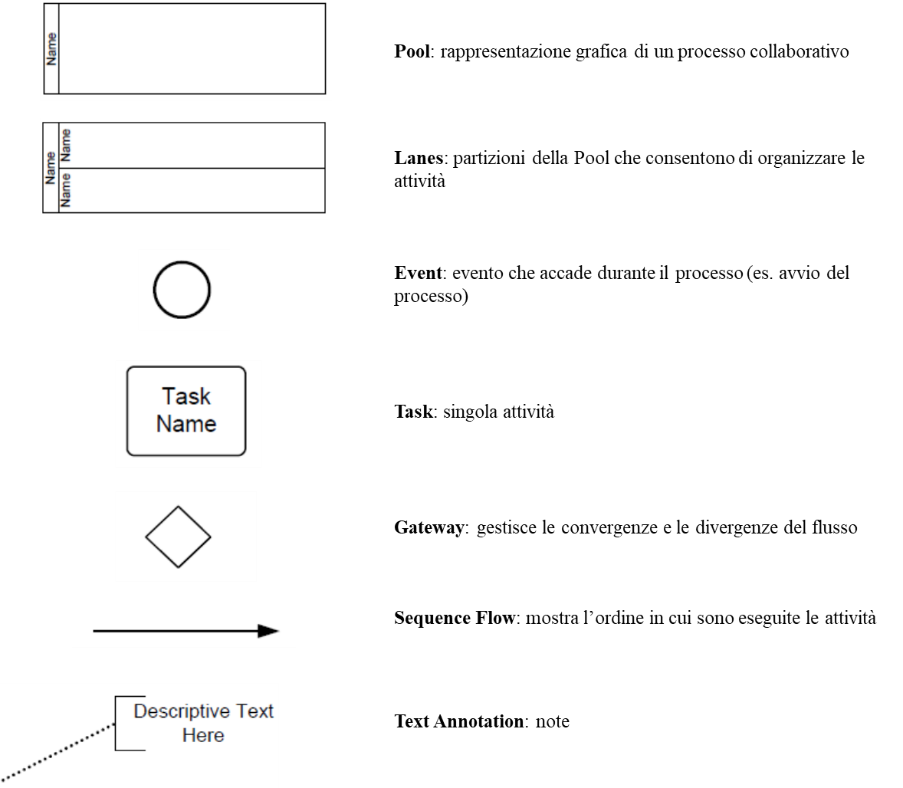

SEZIONE II – REGOLE DI FUNZIONAMENTO DEL SISTEMA

I due diversi *workflow* gestiti sul Sistema pagoPA si differenziano principalmente in base al
soggetto che innesca il pagamento. Avremo quindi un processo diverso se l’utilizzatore finale accede
al servizio di pagamento attraverso tecnologie e funzioni messe a disposizione da un Ente Creditore
ovvero attraverso tecnologie e funzioni messe a disposizione da un Prestatore di Servizi di
Pagamento

Nella presente sezione è modellato il processo di scambio dati tra i sistemi informativi dei tre
soggetti che partecipano a ogni processo di pagamento mediati dal NodoSPC.

La modellazione risultante descrive quindi, da una parte, le specifiche che definiscono il
comportamento progettato del NodoSPC, riportando un set di informazioni certe e conosciute (le
primitive rese disponibili dai Web Services, i dati di configurazione, etc.) e, in un’altra parte,
il comportamento atteso dei sistemi intermediati riportando l’insieme di informazioni minime
indispensabili alle funzioni informatiche effettivamente sviluppate dai soggetti aderenti in qualità
di Enti Creditori o Prestatori di Servizi di Pagamento.

I dettagli delle primitive utilizzate in ciascun *workflow*, i tracciati, gli errori e tutte le
informazioni tecniche necessarie per integrare servizi di Enti Creditori e Prestatori di Servizi di
Pagamento con il NodoSPC sono descritti nella sezione III.

La modellazione segue le notazioni dello standard *Business Process Model and Notation* (BPMN)
versione 2.0, di cui si riporta, in **Figura 1**, i simboli utilizzati e il loro significato.

|image0|

**Figura** **1: Notazioni BPMN 2.0 utilizzate**

Gestione della posizione debitoria
==================================

Come previsto dalle Linee guida, tutte le tipologie di pagamento gestite dal Sistema pagoPA
prevedono che l’Ente Creditore, per rendere realizzabile un pagamento, registri nei propri archivi
le informazioni necessarie per effettuare il pagamento e le metta a disposizione dell’utilizzatore
finale. Definiamo l’insieme di tali informazioni con il termine di “posizione debitoria”.

Nel Sistema pagoPA ogni pagamento presuppone la creazione propedeutica, nel sistema informativo
dell’Ente Creditore, di una posizione debitoria. All’Ente Creditore compete la gestione degli stati
del ciclo di vita della posizione debitoria, che, in linea generale, corrispondono alle attività di:

1. Creazione. La posizione debitoria viene creata dall’ Ente Creditore e posta nello stato di
   “Aperta”. Si sottolinea che, al fine della semplificazione tecnica del sistema, si definisce
   “posizione debitoria” sia la creazione che avviene su iniziativa dell’Ente Creditore (es.
   maturazione delle condizioni per il pagamento di una imposta) sia quella che avviene su
   iniziativa dell’utente (es. richiesta di un servizio), anche se in quest’ultimo caso
   l’utilizzatore finale non è effettivamente in debito con l’Ente Creditore fino a quando non
   acquista il servizio.

2. Aggiornamento. La posizione debitoria viene aggiornata dell’Ente Creditore ogni qualvolta
   intervengano eventi che modificano le informazioni associate a una posizione debitoria (es
   sanzioni per decorrenza dei termini). A valle di tale aggiornamento la posizione debitoria
   riamane in stato di aperta, ma l’Ente Creditore gestisce lo storico delle versioni.

3. Blocco. La posizione debitoria viene bloccata, a discrezione dell’Ente Creditore, nelle more del
   perfezionamento di un pagamento, onde evitare pagamenti ripetuti.

4. Trasferimento. La posizione debitoria è posta nello stato di trasferita nel caso in cui la
   competenza dell’incasso passi a un altro Ente Creditore (es. iscrizione in ruolo).

5. Chiusura. L’Ente Creditore pone la posizione debitoria nello stato “Chiusa” ogni qualvolta
   intervengano eventi che la rendano non più pagabile (es saldo del debito). Lo stato è reversibile
   nel caso in cui intervenga una revoca del pagamento che pone di nuovo la posizione debitoria in
   una nuova versione dello stato di “Aperta”.

Contestualmente alla creazione di una posizione debitoria, l’Ente Creditore, se ne ricorrono le
condizioni, deve predisporre un avviso di pagamento, in almeno una delle seguenti forme:

a) Analogico (sotto forma di avviso cartaceo o file stampabile), da recapitare all’utilizzatore
   finale o che stampa egli stesso effettuando, se previsto, il downloading dal sito web dell’Ente
   Creditore. Tutti i dettagli relativi all’avviso di pagamento analogico sono inclusi nel documento
   collegato *“Il nuovo avviso di pagamento analogico nel sistema pagoPA”* pubblicata sul sito
   dell’Agenzia per l’Italia Digitale.

b) Digitale, da inviare al NodSPC per essere recapitato al servizio di *repository* del Prestatore
   di Servizi di Pagamento scelto dall’utilizzatore finale.

L’avviso è lo strumento che rende possibile l’innesco del pagamento presso i Prestatori di Servizi
di Pagamento, che l’Ente Creditore genera ogni qualvolta le norme lo obbligano a notificare a un
cittadino o a un’impresa l’insorgenza di una posizione debitoria aperta nei loro confronti. In
questo caso l’Ente creditore genera contestualmente anche un avviso in modalità digitale, che
mantiene comunque un carattere bonario.

L’avviso di pagamento analogico, oltre al logotipo del Sistema pagoPA, contiene le informazioni
indispensabili per l'esecuzione del pagamento, che sono dettagliate nella sezione III.

Si attira l’attenzione sulla circostanza che l’importo dell’avviso di pagamento contenuto
nell’avviso analogico è quello corrispondente al momento della produzione di tale documento e quindi
può essere soggetto a variazioni (in più o in meno) al momento in cui ne viene richiesto il
pagamento da parte dell’utilizzatore finale, nel caso sia intervenuto un aggiornamento della
posizione debitoria, purché tale possibilità sia stata effettivamente esplicitata in una avvertenza
sull’avviso.

La peculiarità di alcune postazioni messe a disposizione dai Prestatori di Servizi di Pagamento
rende necessario automatizzare l’acquisizione dei dati presenti sull’avviso di pagamento. Per questo
motivo tale documento è corredato, oltre che dati essenziali sopra citati, anche da un insieme di
elementi grafici facilmente leggibili e decodificabili da apposite apparecchiature.

I processi di creazione, aggiornamento, chiusura o annullamento di una posizione debitoria sono
interni al sistema informativo dell’Ente Creditore. Nei casi previsti tali operazioni scatenano
l’invio di un avviso di pagamento con strumenti digitali (avvisatura digitale), il cui processo è
tracciato nel seguito.

Con l’avvisatura digitale l’Ente Creditore permette agli utenti di accedere allo stato corrente
della propria posizione debitoria. Attraverso il Sistema pagoPA è possibile gestire due tipologie di
avvisatura digitale:

-  Avvisatura digitale *push*, ovvero su iniziativa dell’Ente Creditore

-  Avvisatura digitale *pull*, ovvero su iniziativa di un Prestatore di Servizi di Pagamento per
   soddisfare una richiesta dell’utilizzatore finale

I paragrafi che seguono descrivono i *workflow* gestiti da pagoPA nei due casi.

Avvisatura digitale push (su iniziativa dell’Ente Creditore)
------------------------------------------------------------

La funzione di avvisatura digitale in modalità *push* è un servizio messo a disposizione dal Sistema
pagoPA attraverso il NodoSPC che consente agli utilizzatori finali di ricevere avvisi in formato
elettronico, in modo che il correlato pagamento possa essere effettuato in modalità semplice e
sicura utilizzando il Sistema pagoPA. Salvo diverso avviso le notifiche digitali hanno un carattere
bonario e quindi si affiancano a quelle tradizionali, già previste dalla normativa, senza
sostituirle. Tuttavia, per consentire ai propri clienti la più ampia possibilità di utilizzare tale
strumento innovativo, l’Ente Creditore è incentivato a utilizzarle anche nelle circostanze in cui la
normativa non pone un obbligo formale di notifica.

Per poter ricevere un avviso digitale l'utilizzatore finale dovrà dotarsi di un “cassetto digitale”
che il NodoSPC utilizzerà per il recapito, mediante la sottoscrizione di uno specifico contratto con
un soggetto abilitato da AgID a erogare tale servizio. I Prestatori di Servizi di Pagamento hanno la
possibilità di integrare con essa ulteriori funzioni quali, a titolo di esempio, i servizi di
pagamento offerti sul Sistema pagoPA, notifiche sui dispositivi da essi gestiti, (*app* su PC,
*tablet* e *smartphone*, servizio di *home* *banking*, ecc.), gestione delle scadenze, ecc.

Si puntualizza che l’utilizzatore finale, ossia il soggetto che riceve l’avvisatura da parte
dell’Ente Creditore, è sempre il soggetto debitore dell’Ente Creditore e che, in quanto
l’utilizzatore finale è chiamato a procedere al relativo pagamento che materialmente potrà comunque
essere eseguito da un terzo soggetto (versante) in nome e per conto del debitore (pagatore).

L'adesione al servizio da parte dei Prestatori di Servizi di Pagamento è facoltativa, mentre gli
Enti Creditori che generano un avviso analogico pagabile presso i Prestatori di Servizi di Pagamento
dovranno obbligatoriamente sviluppare tale funzionalità.

Il servizio in oggetto è monodirezionale in quanto prevede la distribuzione di avvisi digitali da
parte degli Enti Creditori verso gli Utilizzatori finali, ma non prevede una risposta da parte di
questi ultimi.

L'iscrizione al servizio di avvisatura effettuata dall'utilizzatore finale presso il Prestatore di
Servizi di Pagamento avrà efficacia per la ricezione di avvisi da parte di tutti gli Enti Creditori
aderenti al Sistema pagoPA.

L'utente finale può iscriversi al servizio di avvisatura presso più Prestatori di Servizi di
Pagamento: in questo caso, in fase di iscrizione presso un altro Prestatore di Servizi di Pagamento
dovrà ricevere una segnalazione di iscrizione "multipla" da parte del Prestatore di servizi di
pagamento che sta trattando l'operazione.

La revoca dell’iscrizione al servizio di avvisatura deve essere richiesta al Prestatore di Servizi
di Pagamento, che ne stabilisce le modalità.

Nel processo di avvisatura *push* (**Figura 2**) sono coinvolti quattro soggetti:

-  utilizzatore finale

-  Ente Creditore

-  NodoSPC

-  Prestatore Servizi di Pagamento dell’Utilizzatore finale

|image1|

**Figura** **2: Il processo di gestione dell’avvisatura push**

Il processo di avvisatura *push* è iniziato dall’Ente Creditore quando genera una posizione
debitoria (*Task* T1.1.1). Una volta generata la posizione debitoria, l’Ente Creditore invia al
NodoSPC gli avvisi digitali da recapitare (*Task* T1.1.2).

Il NodoSPC (*Task* T1.1.3) esegue azioni differenti a seconda che l’utilizzatore finale sia iscritto
o meno al servizio presso un Prestatore Servizi di Pagamento (*Gateway* G1.1.1):

-  Nel caso in cui l’utilizzatore finale sia iscritto tramite Prestatore Servizi di Pagamento, il
   NodoSPC invia l’avviso digitale al Prestatore Servizi di Pagamento (*Task* T1.1.3) che lo
   storicizza in un proprio database e ne dà notifica all’Utilizzatore finale (*Task* T1.1.4) in
   modo che sia a disposizione dello stesso (*Task* T1.1.5)

-  Negli altri casi, il NodoSPC non esegue alcuna azione.

Nel caso in cui l’Ente Creditore modifichi uno dei dati obbligatori dell’avviso (ad esempio:
l’importo), dovrà inviare al NodoSPC una nuova copia dell’avviso digitale con l’indicazione che si
tratta di un aggiornamento.

Nel caso in cui l’Ente Creditore annulli un avviso digitale o tale avviso risulti pagato con
modalità diverse dal Sistema pagoPA, dovrà inviare al NodoSPC una nuova copia dell’avviso digitale
con l’indicazione che si tratta di una cancellazione.

Il processo di aggiornamento e annullamento dell’avviso digitale è analogo a quello della
generazione (**Figura 3**).

Avvisatura digitale pull (verifica della posizione debitoria)
-------------------------------------------------------------

L’avvisatura *pull* è una funzionalità messa a disposizione dell'utilizzatore finale che consente
allo stesso di accedere alla propria posizione debitoria.

Il Sistema pagoPA mette a disposizione tale funzione affinché la posizione debitoria di un
utilizzatore finale possa essere interrogata attraverso altre funzioni messe a disposizione dal
Prestatori di Servizi di Pagamento presso il quale egli è titolare di un cassetto digitale, purché
tale Prestatore di Servizi di Pagamento risulti aderente all'iniziativa. Tale servizio viene erogato
con un’interrogazione della base dati dell’Ente Creditore di competenza, integrato con il “cassetto
digitale”, e avviene secondo uno schema sincrono, attivato dall'utilizzatore finale stesso
attraverso le stesse modalità descritte nel paragrafo precedente.

Nel processo in oggetto (**Figura 3**) sono coinvolti quattro soggetti:

-  utilizzatore finale

-  Ente Creditore

-  NodoSPC

-  Prestatore Servizi di Pagamento dell’utilizzatore finale

|image2|

**Figura** **3: Il processo di gestione dell’avvisatura pull**

Il processo segue i seguenti passi:

-  L’utilizzatore finale accede ad una degli strumenti messi a disposizione dal Prestatore di
   Servizi di Pagamento richiedendo di conoscere la sua (*Task* T1.3.1) posizione debitoria

-  Il Prestatore di servizi di Pagamento inoltra la richiesta all’Ente Creditore attraverso il
   NodoSPC (*Task* T1.3.2 e T1.3.3)

-  L’Ente Creditore predispone la lista delle Posizione Debitorie relative all’utilizzatore finale
   (*Task* T1.3.4) e le inoltra al Prestatore di Servizi di Pagamento attraverso il NodoSPC (*Task*
   T1.3.5).

-  Il Prestatore di servizi di Pagamento riceve la posizione debitoria dell’Utilizzatore finale e
   può informarlo (*Task* T1.3.6)

-  L’utilizzatore finale a questo punto ha a disposizione la propria posizione debitoria (*Task*
   T1.3.7)

Al fine di prevenire utilizzi non consoni, il NodoSPC si riserva la possibilità di applicare
apposite regole di *throttling* (limitazioni nell'utilizzo). Le eventuali regole di *throttling*
sono indicate nel documento “\ *Indicatori di qualità per i Soggetti Aderenti*\ ” pubblicato sul
sito istituzionale dell’Agenzia per l’Italia Digitale.

