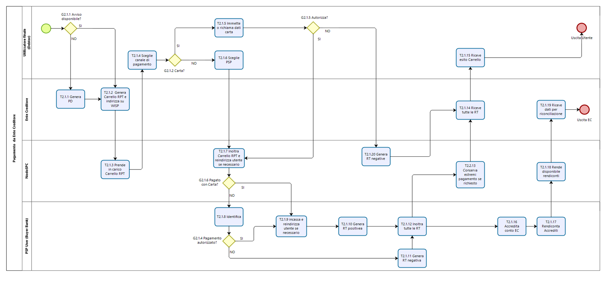

Il Processo di pagamento attivato presso l’Ente Creditore
=========================================================

Rientrano in questa categoria di pagamenti quelli richiesti
dall’utilizzatore finale attraverso i siti web o *mobile app* o altri
strumenti tecnologici messi a disposizione dagli Enti Creditori per i
pagamenti elettronici. Il processo di pagamento attivato presso l’Ente
Creditore consente di gestire le modalità di incasso sia nel caso in cui
l’utilizzatore finale abbia ricevuto un avviso di pagamento, sia nel
caso opposto (pagamenti spontanei)

Le attività a carico degli Enti Creditori per gestire il processo sono
rappresentate dalla realizzazione delle procedure di pagamento (sia in
termini organizzativi, che informatici); le procedure di pagamento
potranno essere più o meno strettamente integrate con i servizi cui
fanno riferimento.

Il diagramma di Figura 8 descrive il processo di pagamento attraverso
l’Ente Creditore. Al fine di rendere tale diagramma immediatamente
leggibile la descrizione del *workflow* è stata aggregata in
sottoparagrafi secondo lo schema logico che segue (**Figura 1**).

|image0|

**Figura** **1** **Schema logico del processo di business del pagamento
presso l’Ente Creditore**

Nel processo in oggetto (**Figura 2**) sono coinvolti quattro soggetti:

-  utilizzatore finale

-  Ente Creditore

-  NodoSPC

-  Prestatore Servizi di Pagamento dell’utilizzatore finale

|image1|

**Figura** **2 Il processo del pagamento da Ente Creditore**

Avvio del pagamento
-------------------

Come descritto nei paragrafi precedenti, l’utilizzatore finale può
eseguire un pagamento per ragioni diverse che generano due diramazioni
distinte (gateway G2.1.1) nel caso abbia disponibile o meno un avviso di
pagamento (digitale e analogico).

Generazione posizione debitoria
-------------------------------

La generazione della posizione debitoria è l’evento che costituisce la
premessa al pagamento sul Sistema pagoPA.

In determinate circostanze, previste nello specifico dalla vigente
normativa, un soggetto matura un debito in favore di una Pubblica
Amministrazione (centrale o locale). In questo caso lo stesso Ente
Creditore assume l’iniziativa di generare una posizione debitoria e
provvede a notificare l’avviso di pagamento al soggetto pagatore. L’EC è
altresì tenuto ad accompagnare la notifica con avviso analogico, anche
con l’invio al NodoSPC di un avviso digitale *push*. Questa attività è
parte del processo di avvisatura digitale.

Nel caso non sussistano le circostanze sopra indicate per il pagamento
dovuto, ovvero l’utilizzatore finale non sia in possesso di un avviso
digitale, lo stesso utilizzatore può assumere l’iniziativa di avviare il
pagamento (pagamento spontaneo). In questo caso, se l’utilizzatore
finale accede a portali messi a disposizione dall’Ente Creditore, la
posizione debitoria è generata (*Task* T2.1.1). È facoltà dell’EC
esporre delle funzioni che consentono al soggetto pagatore di riceve un
avviso digitale (nel caso abbia aderito al servizio) ovvero provveda
alla stampa di un avviso analogico, da utilizzare per disporre il
pagamento presso i Prestatori di Servizi di Pagamento che offrono tale
opzione.

Scelta canale di pagamento 
---------------------------

L’utilizzatore finale accede ai sistemi dell’EC per pagare uno o più
avvisi che gli sono stati recapitati e/o uno o più pagamenti spontanei e
l’Ente Creditore genera il carrello di richieste di pagamento telematico
reindirizzando l’utilizzatore finale sul portale WISP (*Task* T2.1.2).

Il NodoSPC prende in carico il carrello delle richieste di pagamento
telematico (*Task* T2.1.3) mentre l’Utilizzatore finale sceglie il
Prestatore di Servizi di Pagamento e il canale di pagamento.

Per gli utilizzatori finali che scelgono di registrarsi al Sistema
pagoPA sono a disposizione funzioni di supporto che consentono di
memorizzare le scelte di pagamento effettuate per poterle richiamare e
riutilizzare nelle successive occasioni. In questo caso è possibile
eleggere una delle scelte come predefinita così da avere un’esperienza
quanto più possibile simile alla modalità *one-click* tipica dei siti di
*e-commerce*.

I dati personali raccolti saranno trattati, nel rispetto della normativa
vigente, solo per consentire l’erogazione dei servizi richiesti.

Pertanto, detti dati saranno trattati esclusivamente per consentire agli
utenti delle pubbliche amministrazioni e degli altri soggetti aderenti
al Sistema pagoPA di richiedere e ottenere i servizi di pagamento
erogati dai Prestatori di Servizi di Pagamento abilitati sul Sistema
pagoPA, nonché per richiedere e ottenere parimenti i servizi di
identificazione e memorizzazione erogati da AgID sul Sistema pagoPA.

Il conferimento dei dati ed il trattamento degli stessi da parte di AgID
per tali finalità è dunque obbligatorio e non richiede un esplicito
consenso, pena l’impossibilità per l’AgID di erogare i servizi sopra
citati.

Autorizzazione del pagamento 
-----------------------------

L’autorizzazione del pagamento viene effettuata in maniera differente a
seconda del servizio scelto dall’utilizzatore finale:

-  In caso di pagamento con carta di credito o di debito (*Gateway*
   G2.1.2), l’Utilizzatore finale immette (o recupera nel caso li abbia
   precedentemente memorizzati) i dati della carta (*Task* T2.1.4) e gli
   viene proposto il pagamento in una *check out page* gestita dal
   NodoSPC.

   -  Questa tipologia di pagamento prevede che l’autorizzazione del
      pagamento da parte dell’utilizzatore finale sia inizializzata dal
      NodoSPC, attraverso un proprio POS virtuale. Nel caso che la carta
      utilizzata sia stata emessa da un Prestatore di servizi di
      Pagamento aderente al Sistema pagoPA, il relativo gestore
      dell’operazione sarà proposto automaticamente all’utilizzatore
      finale. Questa casistica è denominata pagamento “on us”. Nel caso
      in cui l’utilizzatore finale non confermi tale scelta ovvero il
      Prestatore di Servizi di Pagamento emittente della carta non
      aderisca al Sistema pagoPA, l’utilizzatore finale dovrà scegliere
      il gestore dell’operazione da una lista di Prestatori di servizi
      di pagamento che mostri i costi della commissione richiesta per il
      servizio. In questo caso si realizza un pagamento “not on us”.

      -  I Prestatori di Servizi di Pagamento che offrono il servizio di
         pagamento con carta devono:

   -  indicare al NodoSPC le commissioni richiesta per i pagamenti “on
      us” e i pagamenti “not on us”;

   -  Configurare sul NodoSPC le informazioni necessarie a configurare
      il dialogo tecnico con il POS virtuale con il NodoSPC.

   -  I dettagli delle procedure da seguire sono riportati nella sezione
      IV.

   -  Sul portale dell’Ente Creditore devono essere messe a disposizione
      le funzioni che permettono all’utilizzatore finale di interrogare
      lo stato della sua richiesta di pagamento, scaricare una copia di
      ricevuta o quietanza di pagamento, scaricare copia analogica e/o
      duplicato del documento informatico Ricevuta Telematica.

-  In caso di pagamento con autorizzazione gestita dal Prestatore
   Servizi di Pagamento (a cui si assimila anche il pagamento attraverso
   il circuito MyBank, purché sia previsto un pagamento singolo)
   (*Gateway* G2.1.3), il NodoSPC inoltra in *back-end* il carrello al
   Prestatore di Servizi di Pagamento (o al Wrapper Mybank) (*Task*
   T2.1.5). Se il canale di pagamento del Prestatore di Servizi di
   Pagamento lo prevede, l’esperienza utente del processo di pagamento
   può proseguire in un *front-end* gestito dal Prestatore di Servizi di
   Pagamento (quindi esterno al NodoSPC), prevedendo l’identificazione
   del soggetto versante che autorizza il pagamento (*Task* T2.1.8). In
   ogni caso, a valle della autorizzazione, l’utilizzatore finale viene
   reindirizzato al *front-end* dell’Ente Creditore da cui aveva avviato
   il pagamento (*Task* T2.1.9).

   -  Queste tipologie di pagamento prevedono che l’autorizzazione del
      pagamento da parte dell’utilizzatore finale avvenga mediante
      l’interazione con strumenti messi a disposizione dal Prestatore di
      Servizi di Pagamento. L’esecuzione del pagamento ed il rilascio
      della relativa attestazione (RT) avvengono in funzione delle
      modalità di autorizzazione del pagamento adottate dal Prestatore
      di Servizi di Pagamento. Si distingue quindi l’autorizzazione:

      -  contestuale alla richiesta effettuata, in funzione dei livelli
         di servizio pattuiti con il Prestatore di Servizi di Pagamento,
         se l’utilizzatore finale ha pre-autorizzato il pagamento (ad
         esempio: lettera di manleva o altro strumento contrattuale);

      -  non contestuale, se l’autorizzazione viene rilasciata
         successivamente alla ricezione della richiesta di pagamento
         telematico da parte del Prestatore di Servizi di Pagamento,
         attraverso canali da questo messi a disposizione (ad esempio:
         home banking, notifica su app per smartphone o tablet, ecc.).

         -  In ogni caso il Prestatore di Servizi di Pagamento deve
            restituire la ricevuta telematica nei tempi stabiliti
            secondo quanto previsto nel documento “Indicatori di qualità
            per i soggetti aderenti” pubblicato sul sito istituzionale
            dell’AgID, in modo da consentire all’utilizzatore finale di
            usufruire dei servizi per cui ha pagato.

   -  Nel caso di pre-autorizzazione del pagamento, resta salva la
      possibilità per l’utilizzatore finale di revocare il consenso
      rilasciato al Prestatore di Servizi di Pagamento ad eseguire
      un’operazione di pagamento, in presenza delle condizioni previste
      all’articolo 17 del Decreto legislativo n. 11/2010.

A questo punto, nei casi diversi dall’autorizzazione presso il
Prestatore di Servizi di Pagamento, per il quale l’autorizzazione
avviene al di fuori del NodoSPC, l’Utilizzatore finale decide se
autorizzare (*Task* T2.1.11):

-  In caso negativo, se il metodo di pagamento scelto era carta di
   credito (*Gateway* G2.1.7) il NodoSPC genera una ricevuta telematica
   negativa (*Task* T2.1.14), altrimenti è il Prestatore di Servizi di
   Pagamento che genera la ricevuta telematica negativa (*Task* T2.1.15)

-  In caso positivo, se l’Utilizzatore effettua il pagamento con carta
   (*Gateway* G2.1.6) il NodoSPC inoltra la richiesta di pagamento
   telematico al Prestatore Servizi di Pagamento (*Task* T2.1.12),
   altrimenti il Prestatore Servizi di Pagamento incassa il pagamento
   (*Task* T2.1.12)

Una volta effettuato l’incasso il Prestatore Servizi di Pagamento genera
la ricevuta telematica, redirezionando sul sito dell’Ente Creditore in
caso di carta di credito, (*Task* 2.1.16) e la trasmette al NodoSPC
(*Task* T2.17).

Il NodoSPC mette la ricevuta telematica a disposizione del’Ente
Creditore (*Task* 2.1.17) che a sua volta può mettere a disposizione
dell’Utilizzatore finale una ricevuta (*Task* T2.18).

L’Utilizzatore finale a questo punto può ottenere la ricevuta (Task
T2.1.19) e terminare il processo.

Accredito e rendiconto
----------------------

Dopo aver effettuato il pagamento, il Prestatore Servizi di Pagamento lo
accredita sul conto dell’Ente Creditore (*Task* T2.1.20).

Il Prestatore Servizi di Pagamento invia i dati relativi alla
rendicontazione al NodoSPC (*Task* T2.1.21).

Il NodoSPC trasmette i dati di rendicontazione all’Ente Creditore
(*Task* T2.1.22), che li riceve (*Task* T2.1.23).

