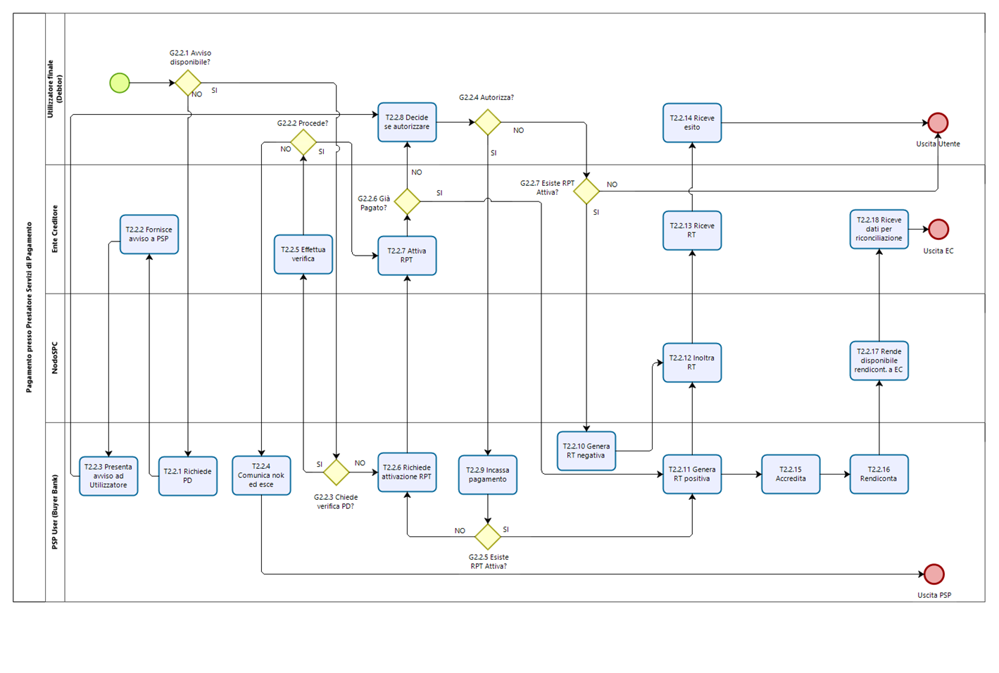

Processo di pagamento attivato presso il Prestatore di Servizi di Pagamento
===========================================================================

Questo processo prevede che l’esecuzione del pagamento avvenga presso le
infrastrutture messe a disposizione dal Prestatore di Servizi di
Pagamento quali, ad esempio, sportelli ATM, applicazioni di *Home
banking* e *mobile* *payment*, uffici postali, punti della rete di
vendita dei generi di Monopolio (Tabaccai), SISAL e Lottomatica, casse
predisposte presso la Grande Distribuzione Organizzata, ecc.

L’Ente Creditore che consente il pagamento deve mettere a disposizione
dei Prestatori di Servizi di Pagamento, attraverso il NodoSPC, un
archivio nel quale siano già stati memorizzati i pagamenti predisposti
dall’ente (Archivio Pagamenti in Attesa).

Per rendere possibile il pagamento l’Ente Creditore ha l’obbligo di
recapitare all’utilizzatore finale un avviso con gli estremi del
pagamento da effettuare. Tale recapito deve obbligatoriamente avvenire
sia in modalità analogica (tramite servizi postali), che digitale.
L’Ente Creditore può inoltre adottare ulteriori misure per la diffusione
degli avvisi di pagamento, per esempio rendere disponibili funzioni di
stampa on line tramite il proprio sito.

Il processo di pagamento descritto di seguito, supporta principalmente
la modalità di incasso su iniziativa dell’Ente Creditore, ma può essere
utilizzato anche per gestire la modalità di incasso su iniziativa del
debitore, atteso che, sul proprio portale, l’Ente Creditore metta a
disposizione dell’utilizzatore finale la possibilità di eseguire
pagamenti presso gli sportelli dei Prestatori di Servizi di Pagamento
generando a richiesta del debitore, un avviso di pagamento utilizzabile
all’uopo.

Anche il modello di pagamento in esame può essere utilizzato dall’utente
per tutti quei servizi per i quali non è necessario disporre in via
immediata dell’attestazione di pagamento, che può essere esibita in un
momento successivo.

Nello schema di Figura 10 è trattato il caso in cui l’utilizzatore
finale, già in possesso dell’avviso di pagamento analogico fornito
dall’Ente, si rechi presso le strutture del Prestatore di Servizi di
Pagamento e comunichi il codice dell'avviso di pagamento. Si tenga
presente che il caso d’uso descritto non dipende dalla concreta modalità
in cui tale dato entra in possesso del Prestatore di Servizi di
Pagamento: il codice potrebbe essere comunicato a un operatore di
sportello, letto automaticamente tramite dispositivi ottici, inserito
manualmente dal soggetto versante su interfacce messe a disposizione dai
Prestatori di Servizi di Pagamento (un terminale ATM, una pagina WEB,
ecc.), ovvero, da ultimo, comunicato tramite avviso digitale.

Il diagramma di Figura 10 descrive il processo pagamento operato presso
il Prestatore di Servizi di Pagamento. Al fine di rendere tale diagramma
immediatamente leggibile la descrizione del *workflow* è stata aggregata
in paragrafi secondo lo schema logico che segue (Figura 8).

|image0|

**Figura** **1 Schema logico del processo di business del pagamento
presso il Prestatore di Servizi di Pagamento**

Nel processo in oggetto (Figura 9) sono coinvolti quattro soggetti:

-  Utilizzatore finale

-  Ente Creditore

-  NodoSPC

-  Prestatore Servizi di Pagamento dell’Utilizzatore finale

|image1|

**Figura** **2 Il processo del pagamento attivato presso il Prestatore
di Servizi di Pagamento**

Avvio del pagamento
-------------------

Come descritto nei paragrafi precedenti, l’Utilizzatore finale può
eseguire un pagamento per ragioni diverse, che generano due diramazioni
distinte (gateway G2.2.1), nel caso che abbia disponibile o meno un
avviso di pagamento (digitale e analogico).

Generazione posizione debitoria
-------------------------------

La generazione della posizione debitoria è l’evento che costituisce la
premessa al pagamento sul Sistema pagoPA.

In determinate circostanze, previste nello specifico dalla vigente
normativa, un soggetto matura un debito in favore di una Pubblica
Amministrazione (centrale o locale). In questo caso lo stesso Ente
Creditore assume l’iniziativa di genera una posizione debitoria e
provvede a notificare l’avviso di pagamento al soggetto pagatore. L’EC è
altresì tenuto ad accompagnare la notifica con avviso analogico, anche
con l’invio al NodoSPC di un avviso digitale *push*. Questa attività è
parte del processo di avvisatura digitale.

Nel caso in cui non sussistano le circostanze sopra indicate per il
pagamento dovuto, ovvero l’Utilizzatore finale non sia in possesso di un
avviso digitale, l’Utilizzatore stesso può assumere l’iniziativa di
avviare il pagamento (pagamento spontaneo), purché sia disponibile la
relativa funzione. In questo caso l’Utilizzatore finale accede a portali
messi a disposizione dal Prestatore di Servizi di Pagamento e
quest’ultimo richiede all’Ente Creditore la generazione della posizione
debitoria (*Task* T2.2.1). L’Ente Creditore risponde con l’invio al
Prestatore Servizi di Pagamento di un numero avviso (*Task* T2.2.2) che
può essere consegnato all’Utilizzatore (Task T2.2.3) che dunque può
decidere se autorizzare (*Task* T2.2.8).

Verifica posizione debitoria e attivazione richiesta di pagamento telematica
----------------------------------------------------------------------------

Nel caso in cui l’Utilizzatore finale abbia ricevuto un avviso di
pagamento e abbia deciso di pagare tramite un Prestatore Servizi di
Pagamento, quest’ultimo, prima di effettuare il pagamento, può
verificare la posizione debitoria utilizzando la specifica funzione, per
accertarsi che il pagamento non sia stato saldato e/o i termini siano
rimasti invariati (per esempio potrebbe essere variato l’importo a causa
di interessi di mora)

Allorché il Prestatore Servizi di Pagamento chiede la verifica della
posizione debitoria (*Gateway* G2.2.3), l’Ente Creditore risponde (Task
T2.2.5) con i dati previsti riguardo lo stato della posizione debitoria,
nonché le possibili variazioni dell'importo dovute ad eventi successivi
all'invio dell'Avviso analogico, ad esempio il superamento della data di
scadenza del pagamento). L’invocazione della funzione di verifica non ha
effetti sullo stato della posizione debitoria.

In caso di sussistenza della posizione debitoria l’Utilizzatore finale
può decidere se pagare o meno (*Gateway* G2.2.2).

-  Se decide di pagare, allora viene attivata la richiesta di pagamento
   telematico (*Task* T2.2.7)

-  In caso contrario il processo termina (*Task* T2.2.4)

Il Prestatore Servizi di Pagamento può, viceversa, invocare direttamente
l’attivazione della richiesta di pagamento telematico (*Task* T2.2.6),
peraltro comprendente la verifica della posizione debitoria.

L’Ente Creditore esegue l’attivazione della richiesta di pagamento
telematico (*Task* T2.2.7.

Il processo si svolge poi diversamente nei casi in cui l’Utilizzatore
finale ha effettuato o meno il pagamento prima che il Prestatore di
Servizi di Pagamento richiedesse l’attivazione della richiesta di
pagamento telematico (*Gateway* G2.2.6).

Nel caso che l’Utilizzatore finale non abbia ancora pagato, deve
decidere se autorizzare il pagamento (*Gateway* G2.2.4):

-  In caso negativo, se non esisteva ancora una richiesta di pagamento
   telematico attiva (*Gateway* G2.2.7) è perché il Prestatore di
   Servizi di Pagamento aveva richiesto la verifica della posizione
   debitoria, quini il processo termina, altrimenti il Prestatore di
   Servizi di Pagamento genera una ricevuta telematica negativa (*Task*
   T2.2.10)

-  In caso positivo il Prestatore Servizi di Pagamento incassa il
   pagamento (*Task* T2.2.9)

Una volta effettuato l’incasso (*Task* T2.2.9) il Prestatore Servizi di
Pagamento genera la ricevuta telematica positiva (*Task* T2.2.11) se
aveva già ricevuto una richiesta di pagamento telematico attivata
(*Gateway* G2.2.5), perché lo aveva richiesto, altrimenti richiede la
attivazione della richiesta di pagamento telematico (*Task* T2.2.6) che
viene generata dall’Ente Creditore (*Task* T2.2.7) e solo a questo punto
il Prestatore Servizi di Pagamento può generare la ricevuta telematica
positiva (*Task* T2.2.11).

Nel caso di emissione di ricevuta telematica positiva il Prestatore di
Servizi di Pagamento consegna all’Utilizzatore finale un’attestazione di
pagamento, contenente le informazioni specificate nella sezione III.
Tale attestazione è opponibile all’EC.

Le ricevute telematiche sia positive che negative vengono trasmesse al
NodoSPC.

Il NodoSPC mette la ricevuta telematica a disposizione dell’Ente
Creditore (*Task* 2.2.12) che a sua volta può mettere a disposizione
dell’Utilizzatore finale una ricevuta (*Task* T2.2.13).

L’Utilizzatore finale a questo punto può ottenere la ricevuta (Task
T2.2.14) e terminare il processo.

Trasmissione dati di accredito e rendicontazione
------------------------------------------------

Dopo aver effettuato il pagamento, il Prestatore Servizi di Pagamento
accredita il conto dell’Ente Creditore specificato dalla richiesta di
pagamento telematico ed invia al NodoSPC i dati relativi alla ricevuta
telematica accreditata (*Task* T2.2.15

Nel caso che in cui venga effettuato un accredito cumulativo il
Prestatore Servizi di Pagamento invia i dati relativi alla
rendicontazione al NodoSPC (*Task* T2.2.16).

Il NodoSPC mette a disposizione i dati di rendicontazione per l’Ente
Creditore (*Task* T2.2.17). Quando l’Ente Creditore scarica i dati di
rendicontazione (*Task* T2.2.18).

Attivazione della richiesta di pagamento 
-----------------------------------------

Il NodoSPC non controlla l’effettiva sequenza operativa scelta dal
Prestatore di Servizi di Pagamento, relativa alle fasi del processo
descritte in precedenza: pertanto, un Prestatore di Servizi di Pagamento
potrebbe effettuare la richiesta di attivazione della richiesta di
pagamento telematico senza aver preventivamente effettuato la fase di
verifica. Con questo approccio è sconsigliato far precedere l’incasso
alla richiesta di attivazione della richiesta di pagamento telematico
(*Task* T2.2.6), in quanto sul Sistema pagoPA non è gestito
automaticamente il caso in cui l'Ente Creditore non riesca a inviare la
richiesta di pagamento telematico prevista dal *workflow*: per esempio,
nel caso in cui il pagamento sia già stato eseguito con un altro canale
oppure perché l'importo dovuto sia diverso da quello stampato
sull'avviso.

In questo caso il Prestatore di Servizi di Pagamento avrebbe incassato
dei fondi ai quali non può essere associata una Ricevuta Telematica da
inviare all'Ente Creditore. Per questo caso, nella sezione III, sono
previste delle gestioni semi-manuali. A tal proposito si ricorda che, ai
sensi delle Linee guida, i pagamenti effettuati attraverso il NodoSPC
sono liberatori del debito a condizione che la Ricevuta Telematica sia
congruente con le informazioni presenti sulla relativa richiesta di
pagamento telematico e quindi sull'archivio dei pagamenti in attesa.

